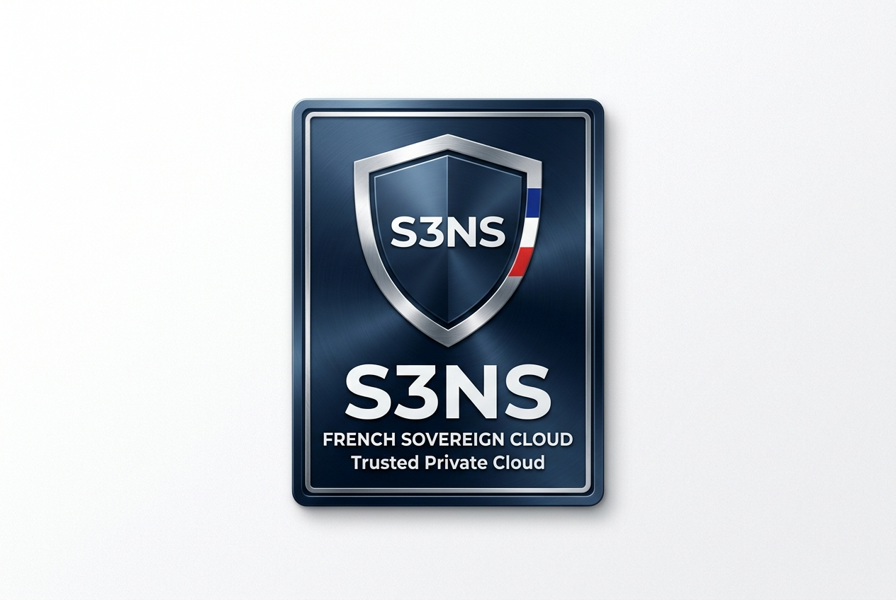
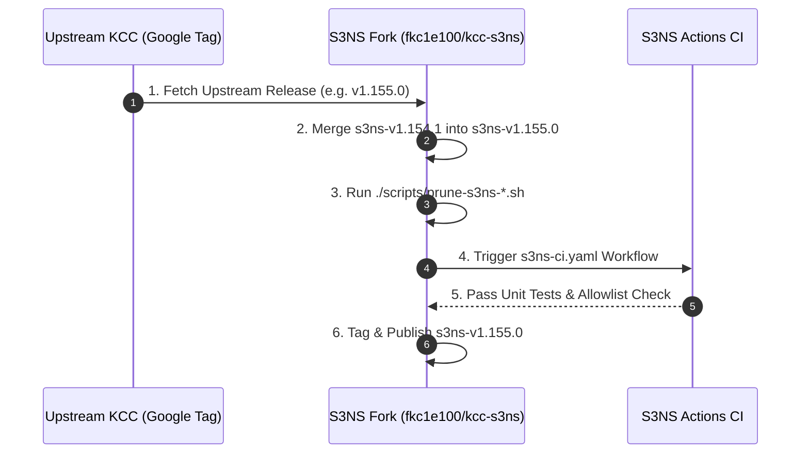

<p align="center">
  
</p>

# S3NS KCC — Upstream Synchronization & Release Build Guide

This guide details the operational procedure for synchronizing **[`fkc1e100/kcc-s3ns`](https://github.com/fkc1e100/kcc-s3ns)** with official Google Cloud KCC releases (`v1.155.0+`) and generating official **`s3ns-kcc-release-bundle-${VERSION}.tar.gz`** release artifacts.

---

## 1. Upstream Synchronization Workflow



---

## 2. Automated Upstream Sync Script (`scripts/sync-upstream.sh`)

The repository includes an automated synchronization script [`scripts/sync-upstream.sh`](file:///usr/local/google/home/fcurrie/Projects/kcc-s3ns/k8s-config-connector/scripts/sync-upstream.sh):

```bash
# Fetch and merge upstream release tag v1.155.0
./scripts/sync-upstream.sh v1.155.0
```

### Step-by-Step Procedure:

| Step | Action | Technical Command / Scope |
| :--- | :--- | :--- |
| **1. Fetch Tags** | Fetch upstream tags | `git fetch upstream --tags` |
| **2. Create Branch** | Checkout new release branch | `git checkout -b s3ns-v1.155.0 tags/v1.155.0` |
| **3. Merge Commits** | Merge S3NS sovereign commits | `git merge s3ns-v1.154.1 --no-ff` |
| **4. Prune CRDs** | Purge new unneeded CRDs | `./scripts/prune-s3ns-crds.sh` |
| **5. Prune Samples** | Purge new unneeded samples | `./scripts/prune-s3ns-samples.sh` |
| **6. Prune Mocks** | Purge new unneeded mocks | `./scripts/prune-s3ns-mockgcp.sh` |
| **7. Validate** | Run unit tests | `go test -v ./pkg/universe/...` |
| **8. Publish** | Push sovereign release tag | `git push origin s3ns-v1.155.0` |

---

## 3. Building Release Bundles (`dev/tasks/build-release-bundle`)

To produce official release artifacts for customer distribution:

```bash
# Execute the release bundle builder
VERSION="v1.154.1-s3ns" ./dev/tasks/build-release-bundle

# Generated Release Artifacts in dist/:
# 1. dist/s3ns-kcc-release-bundle-v1.154.1-s3ns.tar.gz
# 2. dist/release-bundle.tar.gz (symlink)
```

The resulting `s3ns-kcc-release-bundle-${VERSION}.tar.gz` bundle contains:
- `crds.yaml`: Combined 40-CRD S3NS allowlist manifest.
- `install-bundle-autopilot-workload-identity/`: GKE Autopilot Workload Identity installation bundle.
- `install-bundle-namespaced/`: Multi-tenant namespaced installation bundle.
- `samples/`: Approved S3NS sample resource configurations.
