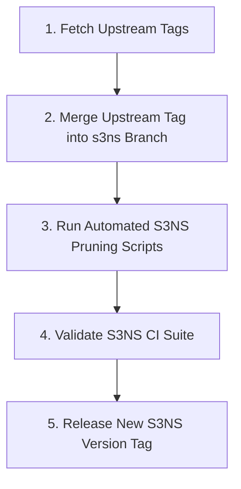

# S3NS KCC — Upstream Sync & Operational Considerations

This guide documents how the [`fkc1e100/kcc-s3ns`](https://github.com/fkc1e100/kcc-s3ns) fork maintains synchronization with the official Google Cloud upstream repository ([`GoogleCloudPlatform/k8s-config-connector`](https://github.com/GoogleCloudPlatform/k8s-config-connector)), along with critical operational considerations.

---

## 1. Upstream Sync Strategy & Workflow

When Google releases new KCC versions (e.g. `v1.155.0`, `v1.156.0`), follow this 5-step workflow to incorporate upstream bug fixes, security patches, and new Direct Controllers.



### 1.1 Step-by-Step Execution

```bash
# 1. Ensure upstream remote is configured
git remote add upstream https://github.com/GoogleCloudPlatform/k8s-config-connector.git || true
git fetch upstream --tags

# 2. Create a new release branch for the target upstream version (e.g., v1.155.0)
git checkout -b s3ns-v1.155.0 tags/v1.155.0

# 3. Cherry-pick / Merge S3NS Sovereign commits from previous branch
git merge s3ns-v1.154.1 --no-ff -m "merge(s3ns): integrate S3NS TPC enhancements into v1.155.0"

# 4. Re-run Automated Pruning Suite
./scripts/prune-s3ns-crds.sh
./scripts/prune-s3ns-samples.sh
./scripts/prune-s3ns-mockgcp.sh

# 5. Run Verification & Unit Tests
go test -v ./pkg/universe/...
go test -v ./pkg/config/...

# 6. Commit and push to GitHub
git add .
git commit -m "chore(s3ns): finalize S3NS v1.155.0 release bundle"
git push -u origin s3ns-v1.155.0
```

---

## 2. Key Operational & Architectural Considerations

### 2.1 Upstream Direct Controller Tracking
- In upstream KCC releases, Google is actively porting resources from TF2CRD/DCL to **Direct Controllers**.
- When Google completes the Direct Controller port for `ContainerCluster` or `Project` upstream, the S3NS fork will automatically gain native `option.WithUniverseDomain("s3nsapis.fr")` support without custom refactoring!

### 2.2 Sovereign Private Container Registry Mirroring
In air-gapped or restricted S3NS TPC environments:
1. Build controller container image locally: `dev/tasks/build-images`.
2. Push container image to S3NS private registry: `registry.s3ns.fr/kcc/controller-manager:v1.154.1-s3ns`.
3. Update [scripts/deploy-s3ns-kcc.sh](../../scripts/deploy-s3ns-kcc.sh) `IMAGE` environment variable.

### 2.3 Air-Gapped Dependency Management
- All Go dependencies are tracked via standard `go.mod` and `go.sum`.
- For offline builds, run `go mod vendor` to bundle dependencies directly within the repository.
